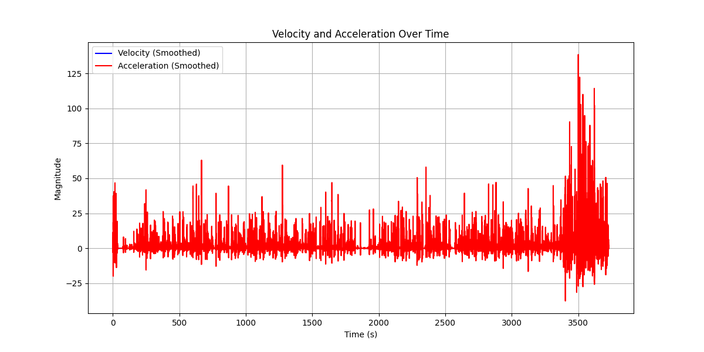
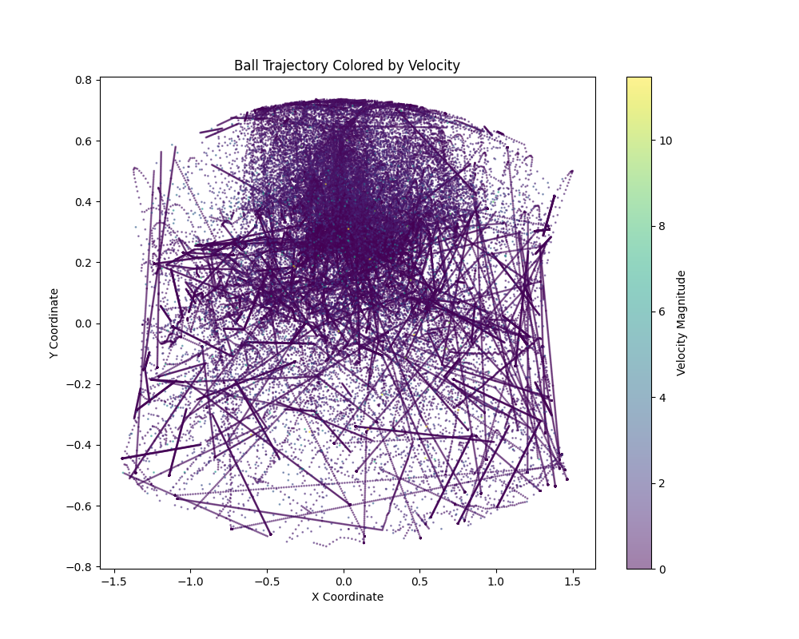
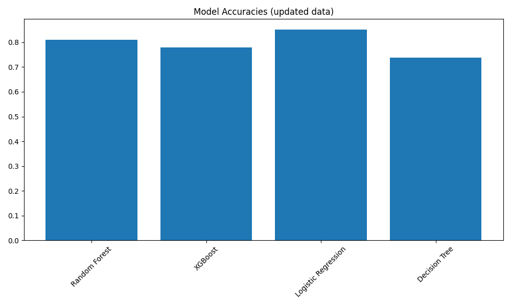
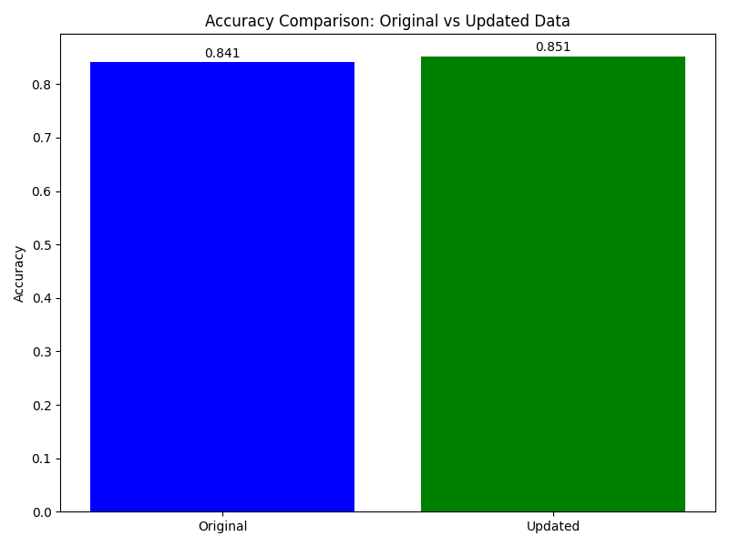
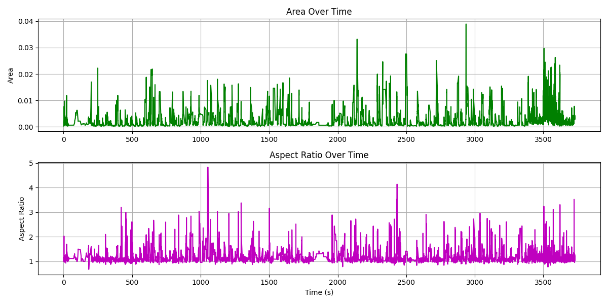
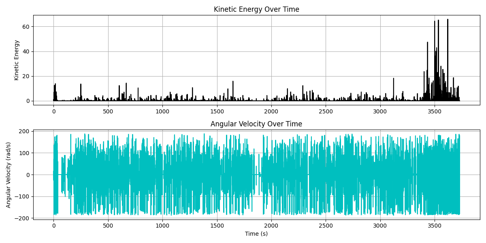

# Sports Highlight Generation System

## Project Overview

This project implements an automated sports highlight detection and extraction system. It leverages machine learning techniques to analyze sports video footage, identify key moments, and automatically generate highlight clips for easier sports content creation and consumption.

## Demo

Check out the generated highlight reel:

[](https://youtu.be/zRsptd_gdoI)

## Key Features

- **Automated Ball Tracking**: Computer vision-based ball tracking in sports videos
- **Feature Engineering**: Extracting motion features (velocity, acceleration, jerk) from ball trajectory data
- **Multi-model Classification**: Using multiple ML models to identify exciting moments
- **Intelligent Filtering**: Post-processing to create coherent highlight segments
- **Automated Highlight Extraction**: Selecting and extracting the most significant segments
- **Modular Pipeline**: Well-defined components for easy extension and modification

## Project Structure

```
project/
├── main.py                    # Main entry point for the pipeline
├── components/                # Core system components
│   ├── feature_engineer.py    # Motion feature extraction
│   ├── classifier.py          # ML model training and prediction
│   ├── output_filter.py       # Post-processing of predictions
│   ├── highlight_maker.py     # Video clip extraction
├── data/                      # Input data directory
│   ├── tracking.csv           # Ball tracking data
│   ├── target.csv             # Ground truth labels
│   ├── video.mp4              # Raw video footage
├── output/                    # Output directory for results
│   ├── highlights.mp4         # Generated highlight video
│   ├── predictions.csv        # Model predictions
│   ├── plots/                 # Visualization and performance plots
```

## Component Details

### 1. Feature Engineer (`components/feature_engineer.py`)

Processes raw tracking data to extract motion parameters:
- Velocity and acceleration in x and y directions
- Speed and acceleration magnitude
- Jerk (rate of change of acceleration)
- Trajectory angle and angular velocity
- Ball area and aspect ratio changes

<div align="center">
  
  <p><em>Analysis of velocity and acceleration patterns during gameplay</em></p>
</div>

<div align="center">
  
  <p><em>Ball trajectory visualization with highlighted significant movements</em></p>
</div>

### 2. Classifier (`components/classifier.py`)

Trains and evaluates multiple ML models:
- Random Forest: Ensemble method with decision trees
- XGBoost: Gradient boosting implementation 
- Logistic Regression: Linear model for classification
- Decision Tree: Simple tree-based classification

The system compares models trained on both raw and enhanced feature sets, automatically selecting the best performing model.

<div align="center">
  
  <p><em>Comparison of model accuracies using enhanced feature set</em></p>
</div>

<div align="center">
  
  <p><em>Accuracy improvement using enhanced features vs. original features</em></p>
</div>

#### Model Selection Process

The classifier component follows these steps to select the optimal model:

1. **Training on Original Data**:
   - Trains all models on the original tracking data
   - Evaluates performance using a 70/30 train/test split
   - Records accuracy, precision, recall, and F1-score

2. **Training on Enhanced Data**:
   - Repeats the process with the enhanced feature set (with added motion parameters)
   - Creates the same evaluation metrics

3. **Model Comparison**:
   - Compares all models from both data types
   - Selects the model with the highest accuracy

In this project, the **Logistic Regression model trained on enhanced features** achieved the highest accuracy of 85.1% and was selected for highlight prediction.

<div align="center">
  
  <p><em>Confusion matrix for the best-performing Logistic Regression model</em></p>
</div>

### 3. Output Filter (`components/output_filter.py`)

Applies multiple filtering techniques to smooth predictions:
- Median filtering to reduce noise
- Majority voting in sliding windows
- Hysteresis thresholding to prevent rapid state changes
- Duration filtering to remove short segments
- Adaptive thresholding based on recent activity

### 4. Highlight Maker (`components/highlight_maker.py`)

Extracts and compiles video highlights:
- Identifies continuous segments of positive predictions
- Selects the 30 most significant segments based on duration and content
- Extracts video clips for each segment
- Assembles final highlight reel in chronological order

## Installation & Setup

1. Create a virtual environment:
   ```bash
   python -m venv mleng_env
   source mleng_env/bin/activate  # On Windows: mleng_env\Scripts\activate
   ```

2. Install the required dependencies:
   ```bash
   pip install -r requirements.txt
   ```

Required packages include:
- numpy, pandas, matplotlib, seaborn
- scikit-learn, xgboost
- opencv-python

## Usage

Run the main pipeline with the following command:

```bash
python main.py <tracking_csv> <target_csv> <video_raw> <output_dir>
```

Arguments:
- `tracking_csv`: Path to the ball tracking data CSV file
- `target_csv`: Path to the ground truth highlight labels CSV file
- `video_raw`: Path to the raw video file
- `output_dir`: Directory to save outputs and results

Example:
```bash
python main.py data/tracking.csv data/target.csv data/video.mp4 output/
```

### Complete Example

Here's a complete example of running the full pipeline:

```bash
# 1. Create and activate virtual environment
python -m venv mleng_env
source mleng_env/bin/activate  # On Windows: mleng_env\Scripts\activate

# 2. Install required packages
pip install -r requirements.txt

# 3. Ensure the data files exist
ls data/
# Should show: tracking.csv, target.csv, video.mp4

# 4. Create output directory if it doesn't exist
mkdir -p output

# 5. Run the pipeline
python main.py data/tracking.csv data/target.csv data/video.mp4 output/

# 6. View the results
ls output/
# Should include: highlights.mp4, predictions.csv, plots/, etc.
```

This will generate a highlight video with the top 30 most significant segments from the sports video, based on ML predictions refined through our pipeline.

## Pipeline Workflow

### 1. Feature Engineering

The system first processes the raw tracking data:
```python
feature_engineer = FeatureEngineer(args.tracking_csv)
features = feature_engineer.extract_features()
```

This creates enhanced tracking data with additional motion parameters.

<div align="center">
  
  <p><em>Ball area and aspect ratio changes during gameplay</em></p>
</div>

### 2. Classification

Multiple models are trained on both original and enhanced data:
```python
classifier = Classifier(args.output_dir)
original_preds, updated_preds, best_preds = classifier.predict(args.tracking_csv, args.target_csv)
```

The best model is automatically selected based on accuracy.

### 3. Post-processing

Predictions are filtered to ensure smooth, coherent highlights:
```python
output_filter = OutputFilter()
filtered_predictions = output_filter.filter(best_preds)
```

### 4. Highlight Generation

The system extracts video clips based on the filtered predictions:
```python
highlight_maker = HighlightMaker()
highlight_maker.create_highlights(filtered_predictions, args.video_raw, highlight_path)
```

## Performance Results

The system achieves:
- Classification accuracy of 85% on highlight detection using Logistic Regression with enhanced features
- 30 significant highlight segments selected from 100+ candidate segments
- Efficient processing suitable for offline highlight generation

## Design Decisions

### Feature Engineering Approach

Motion features are calculated to identify exciting moments based on ball dynamics. This approach was chosen because:
- Ball movement patterns strongly correlate with exciting moments in sports
- Physics-based features (velocity, acceleration) are more interpretable
- These features work well across different sports and scenarios

<div align="center">
  
  <p><em>Energy and angular velocity analysis for highlight detection</em></p>
</div>

### Multi-Model Approach

The system evaluates multiple ML models instead of just one because:
- Different models capture different patterns in the data
- The ideal model can vary depending on the specific sport and data characteristics
- This approach provides more robust performance across different datasets

### Intelligent Filtering

The output filtering system uses multiple techniques because:
- Raw predictions often contain noise and rapid state changes
- Sports highlights need to be coherent segments of sufficient duration
- Different filtering techniques address different aspects of prediction quality

### Highlight Selection

The highlight maker selects 30 segments based primarily on duration because:
- Longer segments typically contain more significant action
- This creates a balanced highlight reel without overwhelming the viewer
- Chronological ordering maintains the narrative flow of the game

## Future Improvements

- Add player tracking data integration
- Implement sound analysis for crowd reactions
- Add real-time processing capabilities
- Support for multiple sports with different highlight criteria
- Deep learning-based feature extraction and classification